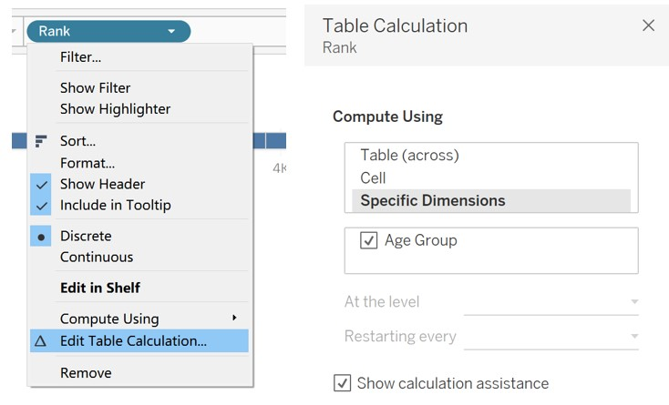
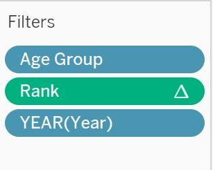
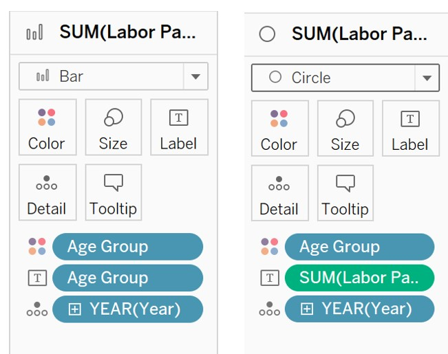
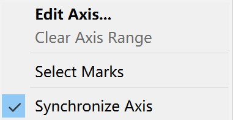
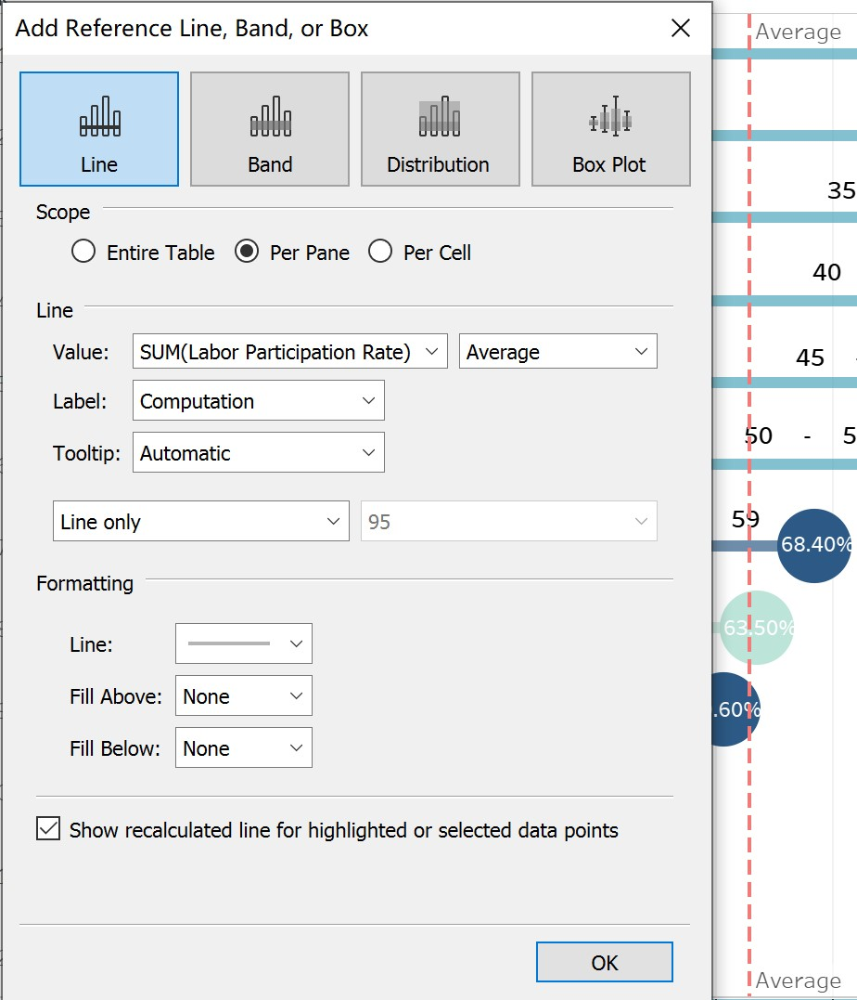

```{r setup, include=FALSE}
knitr::opts_chunk$set(echo = FALSE)
```

**ISSS608 Visual Analytics and Applications - DataViz Makeover 1**

Ziqi Wang ([ziqiwang.2020@mitb.smu.edu.sg](mailto:ziqiwang.2020@mitb.smu.edu.sg))

Data Visualization Link (Tableau Online):

[https://public.tableau.com/profile/ziqi.wang7044#!/vizhome/Makeover1\_16114043960890/LFPR?publish=yes](https://public.tableau.com/profile/ziqi.wang7044#!/vizhome/Makeover1_16114043960890/LFPR?publish=yes)

**1. Critiques and Suggestions for Current Visualization**


**1.1 Clarity**

**a.** The title of the chart does not well convey the purpose of this visualization, it could be more informative if the title includes the specific aspect that the chart reflects. 

Suggestion: In fact, the chart shows the percentage of labor force of each age group account for, therefore, the title can be modified to &quot;Proportion of Resident Labor Force by Age&quot;.

**b.** The aim of this visualization is to reflect the movement of labor force age cohort. In this case, the population is mainly grouped into &quot;labor force aged 25 to 54&quot; and &quot;labor force aged 55 &amp; over&quot;. However, this two groups cannot be obviously differentiated. Additionally, the cumulative proportion of this two age groups cannot be acquired directly from the chart. 

Suggestion: Therefore it's bse dividing line or different colors to depict the two main age groups. Add labels for the cumulative proportion for each group.

**c.** As the major insight of this visualization is that the median age of labor force rose from 41 to 44. The reference lines indicate the median age of each year and are distinguished by color correspondingly, which facilitate easy comparison and observation.

Suggestion: Keep it this way.

**d.** The chart skips the y-axis by putting the percentage of each age group below, to directly perceive the data, presenting numbers in form of visualization would be more useful for readers to gauge the statistical level. Moreover, these values provided in chart are not solely based on or derived from the suggested data source — Table 5: RESIDENT LABOUR FORCE PARTICIPATION RATE BY AGE AND SEX, 2009 – 2019 (JUNE).

Suggestion: This visualization needs to reflect the amount of data as well as the trend of the data, therefore it can be improved by using a combination of histogram and line chart.

**e.** The note at the bottom indicates the rounding issue, which is good. However, the use of the words &quot;may not&quot; is not statistically precise.

Suggestion: The content of the note can be changed to &quot;The figures are rounding to one decimal place&quot;.

**1.2 Aesthetics**

**a.** Overall the use of font, font size, and font color are clear, and the layout is well-structured.

Suggestion: Keep it this way.

**b.** The colors used to represent two different years seems close, which can be improved to highlight.

Suggestion: Use colors with higher degree of contrast.

**c.** The Source is at the bottom center while the Note is at the bottom left, which seems not neat.

Suggestion: Align the Source with Note at the bottom left.

**2. Proposed Design of Alternative Data Visualization**


**3. Data Visualization Steps**

**Data Preparation**

**1.** Delete the entire empty row in the raw data (mrsd\_2019LabourForce\_T5.xlsx), to avoid the null values in further steps.

{width=40%}

**2.** Import raw data to Tableau and select T5\_T table.

**3.**Due to the format of raw data, after Dragging the excel file (mrsd\_2019LabourForce\_T5.xlsx) into Tableau, we can see that the imported data contains many null values as well as a lot of other information. To tidy up the dataset, we check the box in front of &quot;Use Data Interpreter&quot;. Then it will automatically exclude the unrelated data.

{height=80% width=40%}

Since the first column still contains null values and texts, thus we hide the entire column.


**4.** Press the Ctrl key to select all column except &quot;Age (Years)1&quot;, then create pivot table by right clicking.

{width=40%}

Change the column names accordingly.

{width=30%}

**Tableau Works**

**1.** Create the &quot;Labor Participation Rate&quot; calculation field to change the data format of &quot;Participation Rate&quot; into percentage.

{width=30%}
{width=30%}

**2.** Create the &quot;Rank&quot; calculation field by right clicking the empty filed of &quot;Data&quot;.

{width=50%}

**3.** Drag &quot;Labor Participation Rate&quot; into &quot;Columns&quot;, and &quot;Rank&quot; into &quot;Rows&quot;. Set &quot;Rank&quot; as discrete.

{height=80% width=30%}

**4.** Put &quot;Age Group&quot; into Marks – Label.

{height=80% width=30%}

**5.** Select &quot;Edit Table Calculation&quot; by right clicking &quot;Rank&quot;, then select &quot;Specific Dimensions&quot; in the pop-up window.

{width=40%}

**6.** Drag &quot;Year&quot; into &quot;Pages&quot; and change the property into Year. Edit title accordingly.
{width=40%}

{width=50%}

**7.** Put &quot;Age Group&quot;, &quot;Rank&quot;, and &quot;YEAR(Year)&quot; to Filters, so that we can edit filters according to our focus.

{height=80% width=30%}

**8.** Edit color of &quot;Age Group&quot;, use darker color for elder group.
{width=50%}

**9.** Create lollipop chart, firstly Drag &quot;Labor Participation Rate&quot; into &quot;Columns&quot;.

{width=50%}

**10.**Right click the x-axis on the right side and select &quot;Dual Axis&quot;

{height=80% width=40%}

**11.** Mark one &quot;Labor Participation Rate&quot; as Bar and another as &quot;Circle&quot;.
{width=40%}

**12.** Right clicking the x-axis and select &quot;Synchronize Axis&quot;

{width=30%}

**13.** Adjust the position, size and color of labels to fit the view.

**14.** Add reference line by right clicking the x-axis to show the average participation rate.
{height=80% width=40%}

**15.** Add caption to indicate the data source.

**4. Final Visualization Output**


**5. Major Insights**

**a.** While selecting the year from 2009 to 2019, we can observe that the reference line shifts to the right gradually, which means the average labor force participation rate increased over the year, from 62.73% to 67.97%.

**b.** We use the light blue represents the young labor force (aged from 15-24), the azure represents the meddle-aged labor force (aged from 25-54), and the dark blue for the elder labor force (55 &amp; over). By selecting the year from 2009 to 2019, we can observe that although the labor force participation rate of the elder age cohort increased, the labor force participation rate of middle-aged labor force remained the top, which indicates that middle-aged labor force is the main composition of labor force.

**c.** Labor force participation rate of 20 - 24 ranked as 8 in 2009, which is surpassed by Labor force participation rate of 55 – 64 and decreased from 63.50% to 61.0%. Based on this, we can infer that the overall age of labor force has increased along the years.