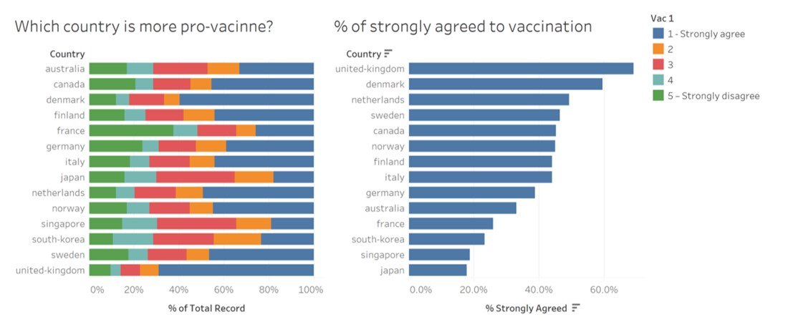

```{r setup, include=FALSE}
knitr::opts_chunk$set(echo = FALSE)
```

## ISSS608 Visual Analytics and Applications - DataViz Makeover 2

Ziqi Wang ([ziqiwang.2020@mitb.smu.edu.sg](mailto:ziqiwang.2020@mitb.smu.edu.sg))

Data Visualization Link (Tableau Online):

[https://public.tableau.com/profile/ziqi.wang7044#!/vizhome/DataVizMakeover2\_16128816342210/Sheet1?publish=yes](https://public.tableau.com/profile/ziqi.wang7044#!/vizhome/DataVizMakeover2_16128816342210/Sheet1?publish=yes)

### 1. Critiques and Suggestions for Current Visualization


**Clarity**

1. The title of the chart on the left side does not well revealed by the visualization, since the percentage of &quot;1 - Strongly agree&quot; is disordered. (Suggestion: It could be more informative if we either highlight the highly pro-vaccine countries or use descending order to display the percentage of &quot;1 - Strong agree&quot;.)
2. As some of the subgroups (degrees of agreement) have similar percentage, therefore the length of their bars cannot be easily distinguished through observation. (Suggestion: Add labels to indicate the percentage of each subgroups.)
3. By referring to the chart on the left side we cannot obviously differentiate negative opinions form positive ones. (Suggestion: It can be improved by using Gantt bar to show negative values on x-axis and present the negative opinion on the corresponding side.)
4. Regard to the chart on the left, it&#39;s hard for readers to gauge the statistical level for countries such as Australia, Canada and Denmark etc., since they are further from the x-axis with different starting points for each subgroup. (Suggestion: It would be more readable to add gridlines to extend the vertical axes across the chart.)
5. The legend of the chart may cause confusions, because for &quot;2&quot;, &quot;3&quot;, and &quot;4&quot;, the degrees of agreement are not indicated specifically. (Suggestion: To clarify the degrees of agreement as well as make the legend consistent, &quot;2&quot;, &quot;3&quot;, and &quot;4&quot; can be modified to &quot;2 – Agree&quot;, &quot;3 – Neutral&quot;, and &quot;4 – Disagree&quot;.)
6. The data source of charts is not indicated. (Suggestion: Provide the link of data source at the left corner to make the visualization complete.)

**Aesthetics**

1. Overall, the use of font, font size, and font color are clear, and the layout is well-structured. (Suggestion: Keep it this way.)
2. The initial letter of country name is in lower case. (Suggestion: Capitalize the initial letter of country name as proper nouns.)
3. The bar chart on the right side is shown in one color which can be improved for better differentiation. (Suggestion: Use various colors to represent for each country or according to their degree of pro-vaccine.)
4. The digital places of x-axis for two charts are inconsistent. (Suggestion: Keep one or zero digital place for both to make them coordinate.)

### 2. Proposed Design of Alternative Data Visualization**


### 3. Data Visualization Steps**

**Data Import**

1. Unzip all the zip files and put them in the same folder, then drag australia.csv into Tableau, the Tableau will automatically recognize all the csv files in the folder. We can add other country&#39;s data files by double clicking &quot;New Union&quot;.

{height=80% width=30%}

**Data Preparation**

1. Keep &quot;household\_size&quot;, &quot;vac\_2&quot; and &quot;Table Name&quot; and hide other columns.

2. Add Filter to &quot;vac\_2&quot; and deselect null values.

{width=40%}

3. Rename &quot;Table Name&quot; to &quot;Country&quot;.

4. Create calculation filed named &quot;Score&quot; to extract numbers from &quot;vac\_2&quot;, and replace &quot;1 – Strongly Agree&quot; to &quot;5&quot; and so on. Then convert &quot;Score&quot; to dimension.

{width=40%}

5. Edit aliases for &quot;Score&quot; and &quot;Country&quot;.

{height=80% width=30%}

6. The dataset looks like below after tidying up.

{width=40%}

**Tableau Works**

1. Create calculation filed named &quot;Number of Records&quot;.

{width=40%}

2. Create calculation filed named &quot;Total Count&quot;.

{width=40%}

3. Create calculation filed named &quot;Percentage&quot;.

{width=40%}

4. Create calculation filed named &quot;Count Negative&quot;.

{width=40%}

5. Create calculation filed named &quot;Total Count Negative&quot;.

{width=40%}

6. Create calculation filed named &quot;Gantt Start&quot;.

{width=40%}

7. Create calculation filed named &quot;Gantt Percent&quot;.

{width=40%}

8. Change default property type of &quot;Percentage&quot; and &quot;Gantt Percent&quot; to percentage and keep one decimal place.

9. Drag &quot;Gantt Percent&quot; to &quot;Column&quot;, and &quot;Country&quot; to &quot;Row&quot;. Then add &quot;Score&quot; to &quot;Color&quot;. After that, edit table calculation for &quot;Gantt Percent&quot; and computing using &quot;Score&quot;. Last but not least, change &quot;Automatic&quot; to &quot;Gantt Bar&quot;.

{width=90%}

10. Add &quot;Percentage&quot; to &quot;Size&quot;.

11. Add &quot;household\_size&quot; to &quot;Filter&quot;, then uncheck &quot;Don&#39;t know&quot; and &quot;Prefer not to say&quot;. After that, clicking on &quot;Show Filter&quot;. Finally set &quot;Single Value (list)&quot; for filter button.

12. Change colors to beautify the view.

13. Add title and caption for data source.

### 4. Final Visualization Output


### 5. Major Insights

1. The percentage of &quot;Strongly disagree&quot; for France accounts for a relatively great percentage among all the countries and household size, and the Gantt bar tend to the left side, which indicate severe mood of anti-vaccination.
2. The percentage of &quot;Strongly agree&quot; for Denmark accounts for a relatively great percentage among all the countries and household size, and the Gantt bar tend to the right side, which means Denmark is more pro-vaccine.
3. As the size of the household grows, the percentage of &quot;Strongly agree&quot; decreases for most of the countries, as well as the Gantt bar moves from the right to the left. Therefore, families with less people are more supportive for vaccination, and this could because of financial reasons, education levels etc.