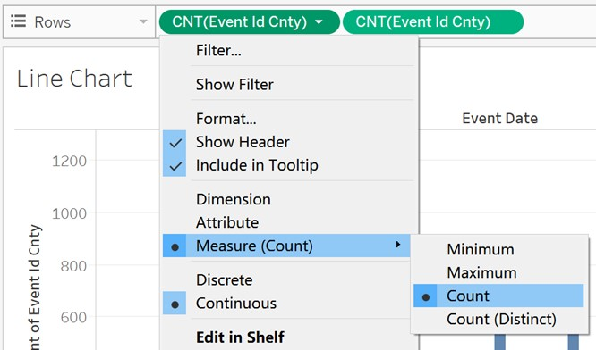

```{r setup, include=FALSE}
knitr::opts_chunk$set(echo = FALSE)
```

## ISSS608 Visual Analytics and Applications - DataViz Makeover 3

Ziqi Wang ([ziqiwang.2020@mitb.smu.edu.sg](mailto:ziqiwang.2020@mitb.smu.edu.sg))

Data Visualization Link (Tableau Online):

[https://public.tableau.com/profile/ziqi.wang7044#!/vizhome/SoutheastAsiaArmedConflict/FinalDashboard?publish=yes](https://public.tableau.com/profile/ziqi.wang7044#!/vizhome/SoutheastAsiaArmedConflict/FinalDashboard?publish=yes)

### 1. Critiques and Suggestions for Current Visualization


**Clarity**

1. Regard to the geographical map, it&#39;s hard for readers to gauge the frequency level solely by observing the dot density.
2. Dots in geographical map are overlapped, resulting in events with low frequency such as &#39;Riots&#39; and &#39;Strategic developments&#39; cannot be easily recognized.
3. Refer to line charts, different ranges are used for y-axes, therefore the trend of data cannot be accurately reflected. For instance, compare with other event types, changes in &#39;Riots&#39; are relatively minor, however they are magnified because of the range of y-axis. On top of that, the name of y-axis may cause confusion as we cannot see &#39;Sheet1&#39;
4. The data source of charts is not indicated.

**Aesthetics**

1. Overall, the use of font, font size, and font color are clear, except the title can be in bold or in a darker color to be better highlighted.
2. The legend as well as the x-axis of the line chart is not fully displayed, it can be improved by restructuring the layout of the dashboard.

**Interactivity**

1. To visual the geographical distribution, readers can only choose one country at a time instead of comparing the frequency of armed conflicts among different countries, since single-valued filter button is used for both charts.
2. The use of dynamic title can well convey the current country selected.

### 2. Proposed Design of Alternative Data Visualization


### 3. Data Visualization Steps

**Worksheet - Trend by Year**

1. Drag &#39;Event Date&#39; and &#39;Event Id Cnty&#39; to Columns and Rows respectively and set Measure of &#39;Event Id Cnty&#39; as Count.

{height=80% width=40%}

2. Drag &#39;Country&#39; to Filters and select Show Filter from the drop-down list. Change filter type to Single Value (list).

{height=80% width=50%}

3. Drag &#39;Event Type&#39; to Filters and select Show Filter from the drop-down list. Change filter type to Single Value (list).

{height=80% width=50%}

4. Set Marks as &#39;Bar&#39;, then edit color, size and opacity of bars.

{height=50% width=20%}

5. Drag &#39;Event Id Cnty&#39; to Rows and set Measure of &#39;Event Id Cnty&#39; as Count.

{height=80% width=40%}

6. Set Marks as &#39;Line&#39;, then edit color, size and opacity of line.

{height=50% width=20%}

7. Right click the y-axis of line chart and select Dual Axis, then right click the merged y-axis and select Synchronize Axis.

{height=80% width=60%}

8. Drag &#39;Event Type&#39; and &#39;Country&#39; to Tooltip.

{height=80% width=20%}

9. Edit axes and add title to Worksheet &#39;Trend by Year&#39; by double clicking.

{height=80% width=50%}

**Worksheet - Stacked Bar Chart**

1. Drag &#39;Event Type&#39; to Color.

{height=80% width=50%}

2. Drag &#39;Event Id Cnty&#39; and &#39;Country&#39; to Columns and Rows respectively and set Measure of &#39;Event Id Cnty&#39; as &#39;Count&#39;.

{height=80% width=25%}

3. Sort &#39;Country&#39; by Count &#39;Event Id Cnty&#39; Field using descending order.

{height=90% width=25%}

4. Set Marks as &#39;Bar&#39;, then edit color and opacity of stacked bars.

{height=80% width=25%}

5. Edit x-axis by right clicking, change the title of x-axis to &#39;Number of Events&#39;.
6. Adjust the size of Worksheet &#39;Trend by Year&#39; and use as visualization in Tooltip.

{height=80% width=50%}

7. Add title to Worksheet &#39;Stacked Bar Chart&#39; by double clicking.

**Worksheet - Map**

1. Drag &#39;Longitude&#39; and &#39;Latitude&#39; to Columns and Rows respectively.

{height=80% width=30%}

2. Click on Fix Map icon and adjust the size of map to show all eight countries.

{height=50% width=30%}

3. Drag &#39;Event Id Cnty&#39; to Color and Size and set measure of both to Count. Then Drag &#39;Country&#39; and &#39;Location&#39; to Detail.

{height=80% width=30%}

4. Drag &#39;Event Type&#39; to Filters and select Show Filter from the drop-down list. Change filter type to Single Value (list).

{height=80% width=50%}

5. Set the Background Maps to Dark.

{height=80% width=40%}

6. Edit color, opacity and size.

{height=80% width=60%}

7. Edit Tooltip.

{height=80% width=40%}

8. Add title to Worksheet &#39;Map&#39; by double clicking.

**Final Dashboard**

1. Create a new Dashboard and drag in Worksheet &#39;Stacked Bar Chart&#39; as well as Worksheet &#39;Map&#39; while pressing Shift key.
2. Adjust size of worksheets and layout of Dashboard.
3. Use Worksheet &#39;Stacked Bar Chart&#39; as Filter

{height=80% width=60%}

4. Format Worksheets by right clicking to make background color consistent.
5. Add title, text and data source.

### 4. Final Visualization Output


### 5. Major Insights

1. During ten years from 2010 to 2020, Philippines, Myanmar, and Thailand have relatively great number of armed conflicts, while Lao, Malaysia and Vietnam have much less armed conflicts among all the listed countries.
2. Violence against civilians is the most prominent conflict type in Philippines, and protests account for a great amount in Indonesia.


3. Protests happened during 2010-2020 are scattered in other countries, but mostly concentrated in Phnom Penh, Cambodia.


4. Battles happened during 2010-2020 are mainly concentrated on northeast of Myanmar and south most of Thailand, both are around borders, while scatter all over Philippines.


5. In Thailand, the number of armed conflicts fluctuated during 2010-2020, and reached at peak in 2013. On top of that, number of protests rose sharply from 2019 to 2020.


